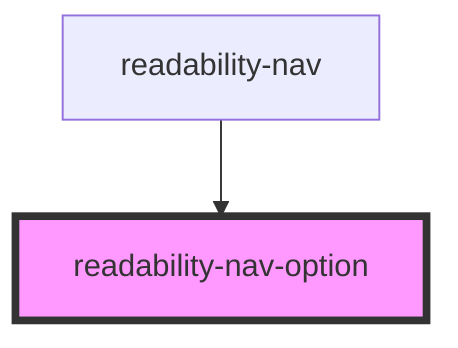

# readability-nav-option

<!-- Auto Generated Below -->

## Properties

| Property      | Attribute     | Description | Type      | Default     |
| ------------- | ------------- | ----------- | --------- | ----------- |
| `description` | `description` |             | `string`  | `undefined` |
| `isSelected`  | `is-selected` |             | `boolean` | `undefined` |
| `label`       | `label`       |             | `string`  | `undefined` |

## Events

| Event                 | Description | Type               |
| --------------------- | ----------- | ------------------ |
| `triggerSelectOption` |             | `CustomEvent<any>` |

## Dependencies

### Used by

 - [readability-nav](..)

### Graph

----------------------------------------------

*Built with [StencilJS](https://stenciljs.com/)*
