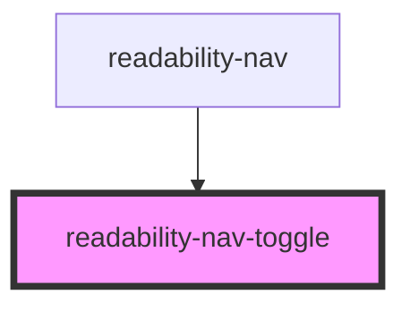

# readability-nav-toggle

<!-- Auto Generated Below -->

## Properties

| Property     | Attribute     | Description | Type      | Default     |
| ------------ | ------------- | ----------- | --------- | ----------- |
| `isExpanded` | `is-expanded` |             | `boolean` | `undefined` |
| `label`      | `label`       |             | `string`  | `undefined` |

## Events

| Event           | Description | Type               |
| --------------- | ----------- | ------------------ |
| `triggerToggle` |             | `CustomEvent<any>` |

## Dependencies

### Used by

 - [readability-nav](..)

### Graph

----------------------------------------------

*Built with [StencilJS](https://stenciljs.com/)*
